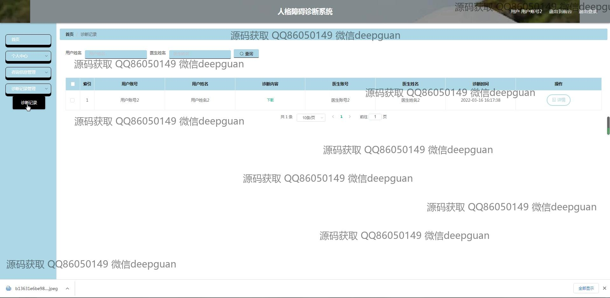

<h1 align="center">人格障碍诊断系统</h1>

## 简介
人格障碍诊断系统：基于Spring Boot开发，角色分为管理员、用户、医生，功能包括用户管理、医生信息管理、咨询信息管理、诊断和测试管理、公告信息处理、系统设置和考试功能，实现在线精神健康咨询与诊断。    --计算机毕业设计源码；毕设源码；java毕业设计源码

## 联系方式

<h3 align="center">获取完整代码与数据库文件 + 微信：deepguan QQ: 86050149 QQ群: 783742310</h3>

<h3 align="center">可帮忙远程部署 包运行成功！提供远程部署、修改代码、设计文档指导、代码讲解等服务！</h3>

## 功能介绍（完整见运行截图）
管理员：管理员在人格障碍诊断系统中扮演关键角色，拥有多项管理和维护功能。可以通过用户管理、医生管理、公告信息管理等模块高效管理平台用户、医生审核与信息发布。导航菜单提供诊断记录管理、咨询信息管理、系统设置等功能，支持添加、修改、删除信息，并进行系统公告编辑发布。管理员还可以通过查询功能精准搜索相关数据，确保平台信息准确无误。

医生：医生在系统中承担着诊断和咨询的主要职责。通过医生信息管理，医生可以维护个人资料，上传头像及医务简介，提供完整的专业背景信息，方便患者了解。医生模块包括咨询信息管理和诊断记录管理，允许医生查看、查询和管理其诊断记录及咨询信息，提高患者互动及病情关注度。此外，医生可以使用内置系统完成对患者人格障碍的评估。

用户：普通用户在系统中主要作为接受诊断和资讯的信息接收端。通过个人中心，用户可以查阅和修改个人信息，了解诊断记录及结果，参与测试，获得专业精神健康建议。用户首页提供咨询医生及相关公告信息查询的入口，支持快速联系医生和查看系统提供的公告，方便用户实时掌握重要信息动态。通过用户管理功能，用户可安全、便捷地进行账号信息更新和管理。

系统开发者：系统开发者负责系统整体架构与功能实现，使用Spring Boot框架进行架构搭建。开发者设计了涵盖注册、登录、角色选择、导航管理等基础功能。通过测评数据以及问题管理模块，开发者确保测试和评估过程的准确性与一致性，并提供了结束考试和成绩显示的功能，使系统能够为用户提供全过程高效的诊断支持。

## 运行截图

本代码来源于网络,仅供学习参考使用!

